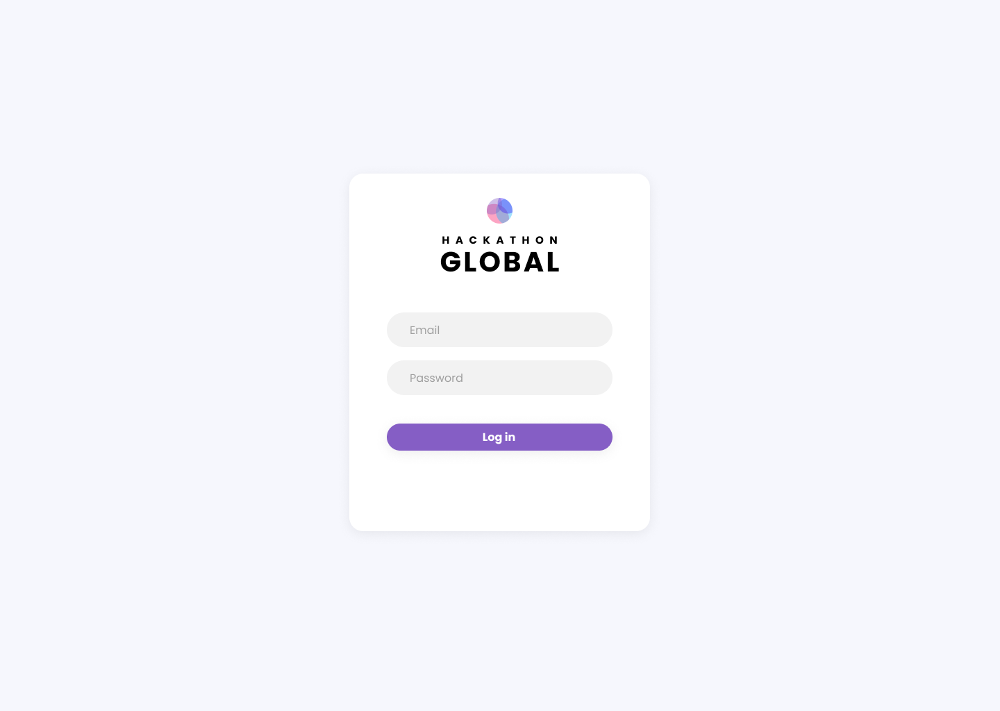

# Hackathon Global

Check it out [⚙️](https://emojipedia.org/gear/): [janakitti.github.io/hackathon-global](https://janakitti.github.io/hackathon-global)

#### Features Completed

- [x] Display all event information on cards
- [x] Sort events by `start_time`
- [x] Full login feature for access to `private` events
- [x] Links to view each related event, disabling them according to permission level
- [x] Event search feature
- [x] Filter by `event_type`
- [x] Static home page

#### Initial Mockups

After reading the project description and noting down the key deliverables, I headed over to **Figma** to come up with the overall design of the UI. This made it much easier to build and style the components when it came to the actual coding.

**Dashboard Page**

**Login Page**

## Part 1

### How did you plan out the structure and design of it? How did you decide on the tools you've used?

#### UI Design

The design of the UI was done using Figma. I wanted to create a UI that was minimalist yet easily scalable. I decided to stick with the traditional side navbar + dashboard style, similar to the designed used for the Attendee Dashboard for Hack the North 2020++. I found that this layout was very flexible and would make it easy for developers to add new features and for users to intuitviely access these features in the future.

#### React + TypeScript

I chose to use React for its simplicity and flexibility as a UI library. When it came to deciding between TypeScript and JavaScript, I chose TypeScript. Although there was a lot of boilerplate code to set up, being able to have code completion and type hinting was helpful for being able to write code confidently. I also wasn't planning on using any uncommon third-party libraries for this project, so I wasn't too concerned about missing type definitions.

#### File structure

I choose to organize my component files by feature, meaning the `.tsx` and `.scss` files that belong to a certain component are grouped together in a single folder. This makes it very easy know where everything is when working on a certain feature and refactoring code.

#### React Router

I used React Router for routing between the Home, Events, and Login page.

#### Context API

When thinking about how to implement a login system, I decided to use Context API as a way to store the current user data and have it be accessible throughout the app. Since the app itself is relatively small and doesn't require high-frequency global state updates, Context API was a better choice for state management than React Redux.

There were several scalability considerations I made when implementing context. Although the context was really only needed to store the user data for this project, I kept the structure of the context as general as possible, leaving it open for adding more states in the future (for example, UI theming or user preferences). In my `/context` directory, I seperated my files into `types`, `actions`, and `reducers` so that the concerns of each major state (i.e. the user state) can be seperated from each other. These were all put together in the `context.tsx`. The `TStore` type contains all the state types and the `mainReducer` is used to generate a generalized `dispatch` function.

#### Styles

I adopted the Block, Element, Modifiers (BEM) methodology for naming my SCSS selectors. Using this strict naming strategy allowed me to write more meaningful class and id names, and make it much easier for future developers to quickly understand their purpose. With BEM, each selector is made up of a Block (standalone entity), Element (element of/semantically tied to its Block), and a Modifier (a flag on the Block or Element to modify its appearance), all put together like this: `block__element--modifier`.  For example: `side-nav__nav-link--selected`.

#### React Bootstrap

I used React Bootstrap for components such as Buttons and Tooltips, as well as for the grid system.

#### Luxon

I used Luxon for formatting the event dates and times.

#### uuid

I used the `uuid` package for generating unique keys to pass to lists of components.

### Did you encounter any problems? And if so, how did you solve them?

#### Routing on GitHub Pages

I ran into some issues with routing after deploying my app to GitHub Pages. I was getting a bunch of `404`s when trying to navigate across pages. I initially had my routes wrapped in a `BrowserRouter `, however upon reading the `react-router-dom` docs, I realized that GitHub Pages doesn’t support routers that use the HTML5 `pushState` history API (which is used by `BrowserRouter`). So whenever GitHub Pages saw a route like `http://janakitti.github.io/hackathon-global/events`, it didn't recognize `/events` as a valid route. The solution was to switch to using routing with hashes, using the `HashRouter` to wrap my routes instead. 

#### Responsiveness

You can't have a frontend project without some responsiveness challenges! Formatting the event cards to be visually appealing yet functional on mobile proved to be a bit challenging, especially with the amount of information that needed to be displayed on a single card. I considered simplifying the cards for the mobile view and adding a "click to expand" button, however I decided to limit my scope and focus on improving the experience on desktop, which is where we'd expect most of our users.

### Are there any areas of your code that you're particularly proud of or want to point out?

#### Context Structure

Although somewhat tedious, I thought that my efforts put into generalizing the structure of my context payed off. I think it makes it so much easier for future developers to scale the app and easily add more states/actions/reducers.

#### UI Design

I had a really great time coming up with the visual design of the app. I'm pretty happy with the overall design language and style consistency. Since the core functionality of the app is to display events, I thought that having each of the event types (workshop, activity, tech-talk) be colour-coded would be a visually appealing and functional way to stylize UI elements. I made sure to be cognizant of user accessibility and tried to keep the presentation of the event details as clear and distraction-free as possible.

I drew some inspiration from the Hack the North branding and the Attendee Dashboard with the Hackathon Global Inc.™ logo and the little creature at the bottom of the page to remind you to drink water!

## Part 2

### Given additional time, how would you extend your application to become a fully functional product?

#### Next.js over Create-React-App

When optimizing for performance, it'll be important to consider network and CPU limitations of users. Hackathon Global Inc.™ will have users coming from across the globe, so we should expect a wide range of user geographies and device types (for example mobile, which typically has less processing power). With this in mind, I would choose to use build the app using Next.js as opposed to Create-React-App, since it supports server-side rendering (SSR). With SSR, we'll be able to send fully rendered pages to the client so that they can view content quicker.

#### Seperate stateful and stateless components

It would be a good idea to differentiate between components that are responsible for handling state/data versus components used purely for styling. This will allow developers to confidently work on stateful components without having to worry about messing up styles, and vice versa.

#### Improve stylesheets

I'd definitely want to improve my stylesheet organization moving forwards. Improvements include making better use of nested classes, parent-children selectors, and SCSS functionality such as `mixins` and `functions` (i.e. since cards are heavily used in the UI, it may be helpful to have a function for defining the general styles of a card component).

#### Improve code consistency

I would adopt tools such as ESLint to produce consistent code patterns that'll make it easier to catch bugs.

#### Code reuse

As the project grows, I might find that I end up reusing a lot of the component logic (for example, event search filtering functionality might be generalizable to other searchable content). I would consider extracting this logic and creating custom hooks to be shared by multiple components.

#### Testing

I would use tools such as React Testing Library or Jest to formally test my React components to catch bugs and make refactoring much easier.